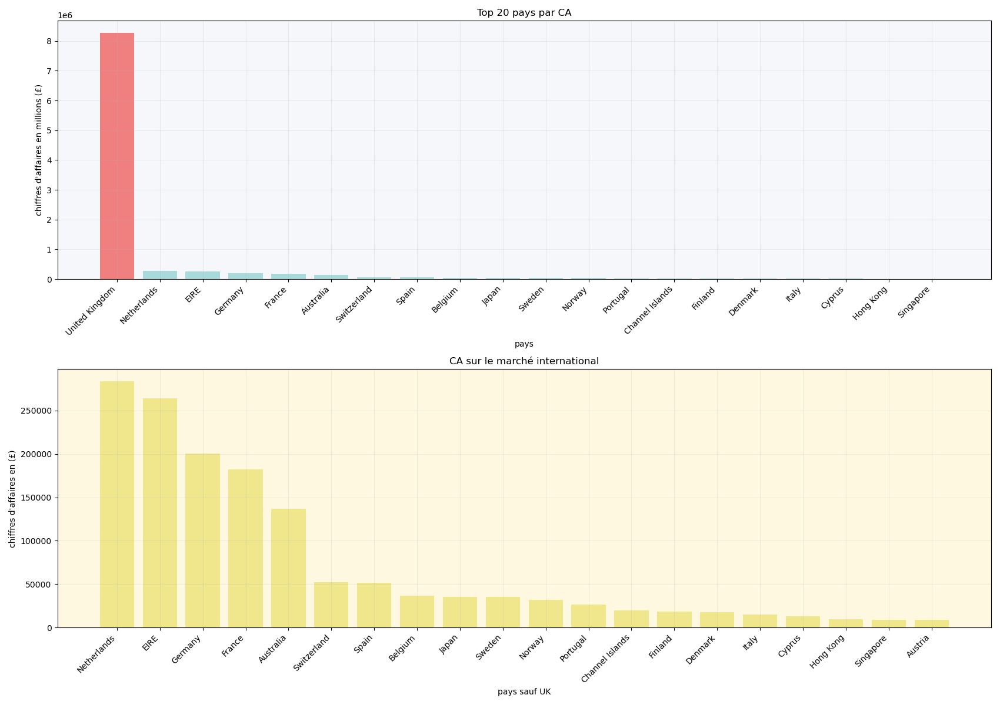

# Online Retail : Analyse & Insights
*E-commerce UK : De la donnée brute aux recommandations stratégiques*

---

## Contexte métier

Le client souhaite identifier les facteurs de croissance de son chiffre d'affaires et définir une stratégie pour l'année suivante. Les données proviennent du jeu de données UCI Online Retail, disponible sur [Kaggle](https://www.kaggle.com/datasets/ishanshrivastava28/tata-online-retail-dataset) dans le cadre d'une simulation de consulting TATA/Forage. Le rôle de consultant data et la boutique fictive sont issus de ce cadre de simulation.

> Dataset non versionné — à télécharger sur Kaggle et à placer dans `datasets/raw/`.
---

## Problématiques

En tant que consultant data, trois questions business ont guidé l'ensemble de l'analyse :

1. Quels produits, quelles périodes et quelles zones géographiques génèrent le plus de CA ?
2. Quels clients sont les plus actifs et comment se segmentent-ils ?
3. Quelles tendances temporelles et anomalies affectent la fiabilité de l'analyse ?

---

## Approche & outils

Chaque outil a été choisi en fonction du besoin, pas pour compléter une liste.

- **Python** : fil conducteur : exploration, nettoyage, analyse
- **SQL** : complément analytique : a fait émerger des insights non détectés avec Python seul
- **Matplotlib** : visualisation ; Seaborn écarté car aucune métrique ne justifiait ses représentations
- **PostgreSQL / DBeaver** : environnement SQL local
- **Jupyter Notebook** : structure narrative du projet

---

## Résultats clés

Trois insights majeurs ressortent de l'analyse :

- **Portefeuille dilué** : parmi les 20 produits les plus lucratifs, aucun ne dépasse 2% du CA global. Le REGENCY CAKESTAND arrive en tête mais affiche le taux d'annulation le plus élevé parmi les 20 premiers - signal à investiguer.
- **Dépendance UK** : 84% du CA concentré sur le marché britannique, sans relais international identifié en cas de turbulence.
- **Creux de début d'année** : la période sept-nov est la plus lucrative, mais la chute de jan-avril est le vrai enjeu stratégique à comprendre.

D'autres facteurs ont été pris en compte dans l'analyse, et les notebooks détaillent l'ensemble des constats et des recommandations.

---

## Visualisation — Marché UK vs Reste du monde



---

## Livrables

- `04_Visualisation.ipynb` : 9 graphiques couvrant 4 dimensions d'analyse (produits, géographie, clients, temporel)
- `05_conclusions.ipynb` : Synthèse business, recommandations actionnables et limites de l'analyse
- Présentation executive (11 slides) destinée à un client non-technique : disponible dans `outputs/reports/`

---

## Structure du projet

```
data-online-retail-month2/
├── datasets/
│   ├── raw/                          # données originales (non versionnées)
│   └── processed/                    # données nettoyées
├── notebooks/
│   ├── 00_Reconnaissance.ipynb
│   ├── 01_Exploration_et_02_nettoyage.ipynb
│   ├── 03_Analyse.ipynb
│   ├── 04_Visualisation.ipynb
│   └── 06_conclusions.ipynb
├── outputs/
│   ├── figures/                      # visualisations exportées
│   └── reports/                      # présentation executive (.pptx)
├── .gitignore
└── README.md
```

---

## Avancement

| Phase | Statut |
|---|---|
| 00 — Reconnaissance | ✅ Terminée |
| 01 & 02 — Exploration & Nettoyage | ✅ Terminée |
| 03 — Analyse | ✅ Terminée |
| 04 — Visualisation | ✅ Terminée |
| 06 — Conclusions & Recommandations | ✅ Terminée |

---


## Auteur

MalickaHoumgbo/ [GitHub](https://github.com/MalickaHoumgbo)